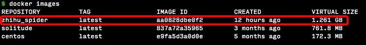
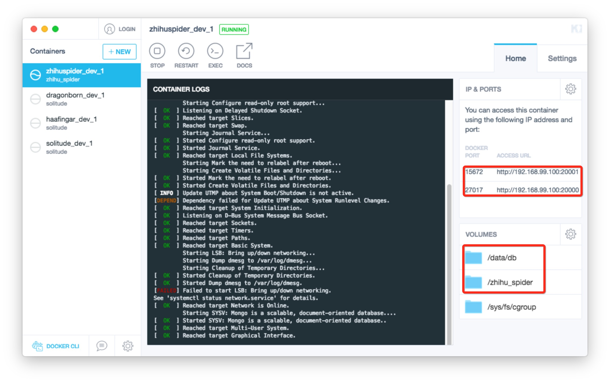
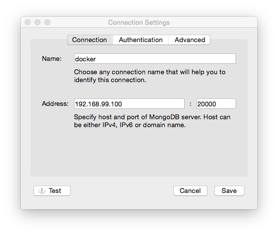
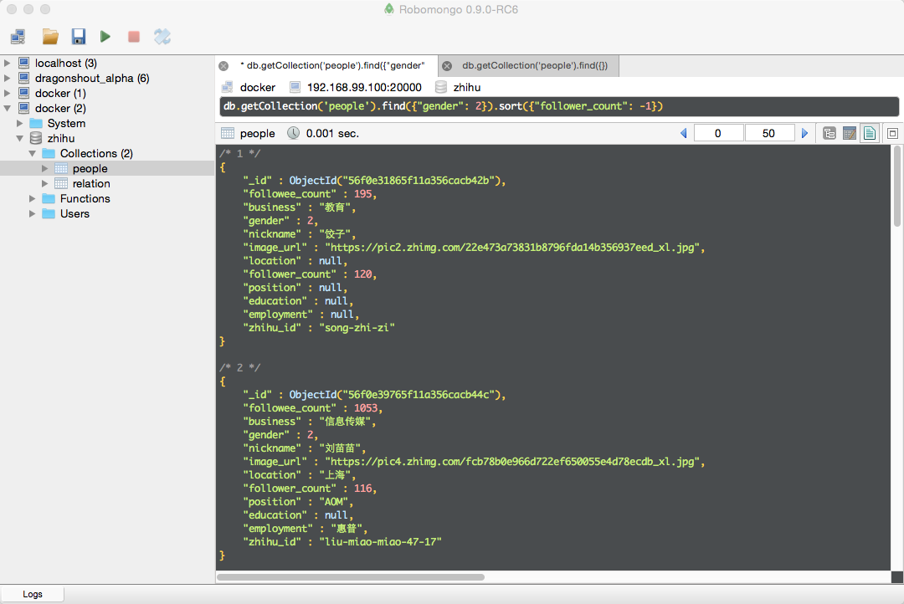

# spider_docker
为爬虫引用创建container，包括的模块：scrapy, mongo, celery, rabbitmq

## 创建image

进入spider_docker目录，执行命令：

```docker build --rm -t zhihu_spider src/```

运行完成后，执行```docker iamges```就可以看到生成的image



## 生成container

在另一个项目[zhihu_spider](https://github.com/LiuRoy/zhihu_spider)中有一个docker-compose.yml文件，可以参考配置：

```
dev:
    image: zhihu_spider

    volumes:
        - ./:/zhihu_spider
        - ../data:/data/db
    ports:
        - "20000:27017"
        - "20001:15672"
    privileged: true
    tty: true
    stdin_open: true
    restart: always
```

以zhihu_spider为例，进入最上层目录后，执行```docker-compose up```命令。


zhihu\_spider目录映射为docker中的/zhihu\_spider，zhihu\_spider统计目录data映射为/data/db用作mongo的数据存储。container中的mongo范文端口映射到本机的20000，rabbitmq映射为本地的20001端口。

## 执行爬虫

执行命令```docker exec -it zhihuspider_dev_1 /bin/bash```即可进入bash。

### 启动mongo

编辑/etc/mongod.conf文件，将绑定ip地址从127.0.0.0改为0.0.0.0，并重启mongod进程。k执行下面命令重启mongo服务

```
mongod --shutdown
mongod --config /etc/mongod.config
```
如果要在本机访问container中的数据，连接配置如下：


ip和port为映射后的ip和port。

### 启动rabbitmq

启动命令如下，访问方式同mongo

```
rabbitmq-plugins enable rabbitmq_management
rabbitmq-server &
```

## 启动爬虫

1. 进入zhihu_spider/zhihu目录，启动异步任务 ```celery -A zhihu.tools.async worker --loglevel=info```
2. 启动爬虫 ```python main.py```

## 结果显示
筛选出女性，并按照粉丝数降序排列



